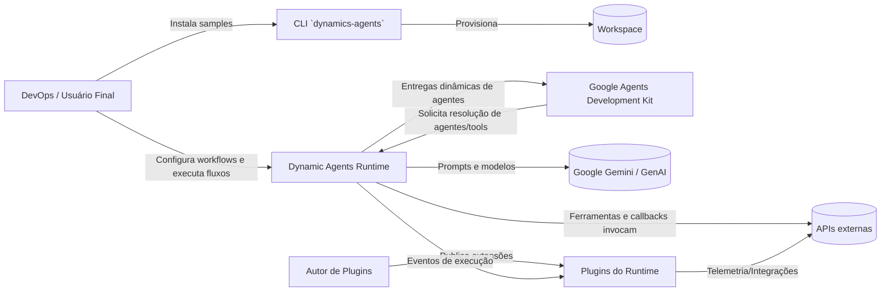
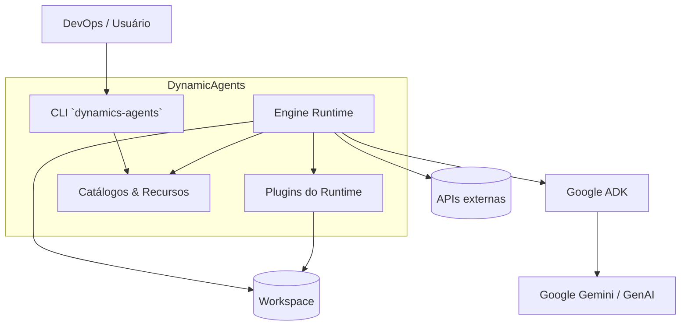
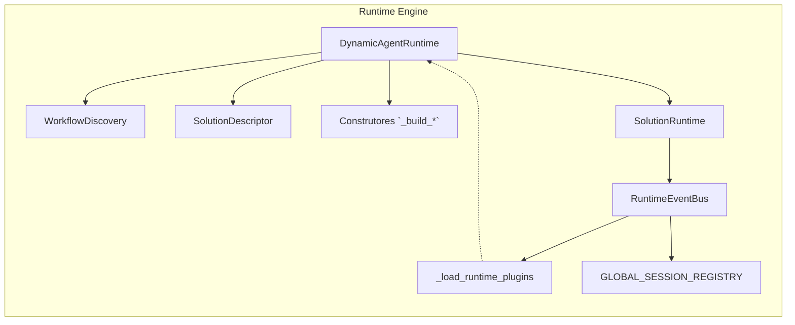
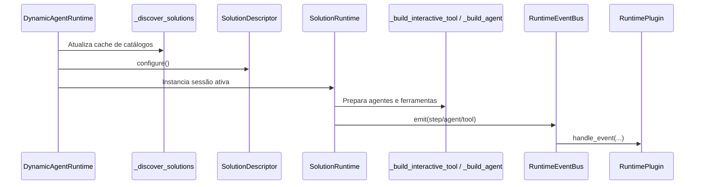
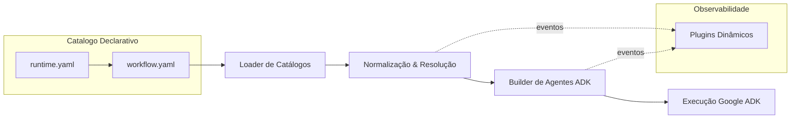
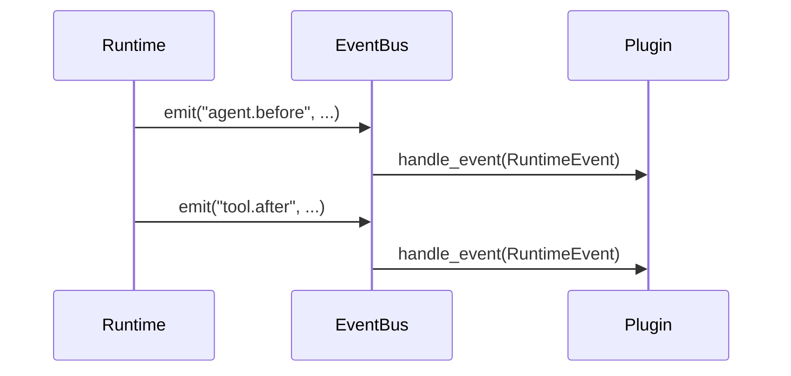
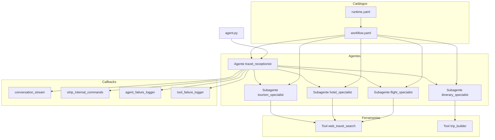
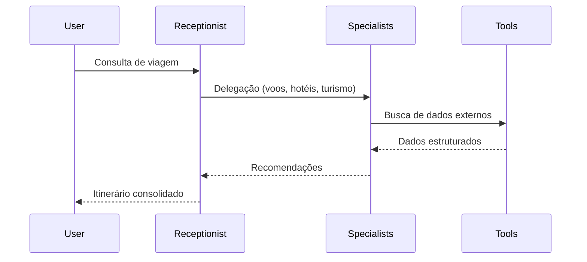
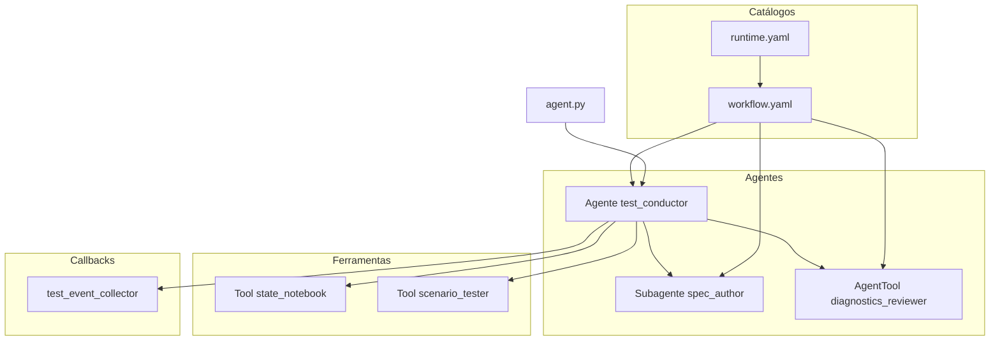

```
██████╗ ██╗   ██╗███╗   ██╗ █████╗ ███╗   ███╗██╗ ██████╗███████╗
██╔══██╗╚██╗ ██╔╝████╗  ██║██╔══██╗████╗ ████║██║██╔════╝██╔════╝
██║  ██║ ╚████╔╝ ██╔██╗ ██║███████║██╔████╔██║██║██║     ███████╗
██║  ██║  ╚██╔╝  ██║╚██╗██║██╔══██║██║╚██╔╝██║██║██║     ╚════██║
██████╔╝   ██║   ██║ ╚████║██║  ██║██║ ╚═╝ ██║██║╚██████╗███████║
╚═════╝    ╚═╝   ╚═╝  ╚═══╝╚═╝  ╚═╝╚═╝     ╚═╝╚═╝ ╚═════╝╚══════╝

        █████╗  ██████╗ ███████╗███╗   ██╗████████╗███████╗
       ██╔══██╗██╔════╝ ██╔════╝████╗  ██║╚══██╔══╝██╔════╝
       ███████║██║  ███╗█████╗  ██╔██╗ ██║   ██║   ███████╗
       ██╔══██║██║   ██║██╔══╝  ██║╚██╗██║   ██║   ╚════██║
       ██║  ██║╚██████╔╝███████╗██║ ╚████║   ██║   ███████║
       ╚═╝  ╚═╝ ╚═════╝ ╚══════╝╚═╝  ╚═══╝   ╚═╝   ╚══════╝  0.1.1
---------------------------------------------------------------------
Dynamics Agents  ::  Orquestração dinâmica de times de agentes inteligentes
v0.1.1 — 2025-10-18 | Author: Willian Patrick dos Santos (wndt@gft.com)
---------------------------------------------------------------------
```

A biblioteca **Dynamics Agents** reúne a Engine do DynamicFlow utilizada para
interpretar catálogos declarativos (`runtime.yaml`, `workflow.yaml`) e gerar a
hierarquia de agentes, ferramentas e callbacks em tempo de execução. O runtime
adapta automaticamente as soluções ao **Google Agents Development Kit (ADK)**,
normaliza instruções e eventos e mantém um conjunto de plugins reutilizáveis.
A CLI integrada é responsável apenas por preparar workspaces instalando os
exemplos oficiais e copiando plugins padrão.

## Visão Geral

- Descoberta dinâmica de soluções multiagente a partir de convenções de
  diretórios.
- Normalização de metadados e wiring automático com o Google ADK.
- Barramento de eventos com suporte a plugins de auditoria, métricas e logging.
- Templates oficiais (`travel_planner`, `self_test_lab`) prontos para uso.
- CLI `dynamics-agents` focada em instalar exemplos e plugins.

## Arquitetura Completa (Engine do DynamicFlow)

## Visão Arquitetônica

### Contexto Geral



### Estrutura de Contêineres



### Componentes Principais da Engine



### Fluxo Interno de Execução



### Visão macro



1. **Loader de Catálogos**: localiza arquivos `runtime.yaml` e `workflow.yaml`
   utilizando `WorkflowDiscovery.iter_solutions` chamado por
   `DynamicAgentRuntime._discover_solutions`.
2. **Normalização & Resolução**: converte o catálogo em objetos `SolutionDescriptor`
   e `AgentSpec`, saneariza nomes, resolve placeholders no estado e injeta
   instruções compostas.
3. **Builder de Agentes ADK**: cria dinamicamente instâncias de `LlmAgent`,
   subagentes, ferramentas e callbacks compatíveis com o Google ADK.
4. **Execução**: o comando `adk` carrega `agent.py`, que delega para a Engine.
5. **Observabilidade**: eventos emitidos pelo runtime alimentam plugins na pasta
   `plugins/` (por padrão, logging estruturado).

### Organização

Uma solução pronta para execução segue o layout abaixo:

```
workspace/
├── plugins/                          # Copiado via `dynamics-agents --init`
│   └── logging/events/runtime/any.00.runtime_logging.py
├── travel_planner/                   # Instalado via `--install-sample`
│   ├── agent.py                      # Ponto de entrada compatível com `adk`
│   ├── runtime.yaml                  # Catálogo de soluções
│   ├── workflow.yaml                 # Workflow principal do recepcionista
│   ├── agents/                       # Subagentes especializados
│   └── tools/                        # Ferramentas e callbacks
└── self_test_lab/
    ├── agent.py
    ├── runtime.yaml
    ├── workflow.yaml
    └── tools/
```

O pacote Python inclui:

- `dynamic_agents/runtime.py`: Engine completa, CLI e helpers.
- `dynamic_agents/plugins/`: plugins padrão instaláveis.
- `dynamic_agents/template_samples/`: templates oficiais (também acessíveis pela
  CLI via *samples*).

### Eventos

O barramento (`RuntimeEventBus`) publica eventos nomeados, permitindo múltiplos
plugins simultâneos. Os principais tópicos emitidos são:

- `solution.discovered`, `workflow.loaded`: descoberta de catálogos.
- `session.started`, `session.finished`: ciclo de vida da execução.
- `agent.before`, `agent.after`, `agent.error`: instrumentação de agentes.
- `tool.before`, `tool.after`, `tool.error`: instrumentação de ferramentas.
- `callback.before`, `callback.after`, `callback.error`: callbacks declarados.

Cada evento inclui metadados ricos (IDs de sessão, labels normalizados, payload
invocado e resultados) permitindo dashboards, telemetria ou alarmes.



### Plugins

Plugins implementam `RuntimePlugin.handle_event` e são carregados a partir de
`plugins/<namespace>/<category>/<name>.py`. O arquivo
`plugins/logging/events/runtime/any.00.runtime_logging.py` demonstra logging
estruturado com níveis configuráveis (`AGENT_ENGINE_LOG_LEVEL`). O comando
`dynamics-agents --init` copia automaticamente o conjunto padrão para o workspace.

### Agentes

- Declarados em `workflow.yaml` dentro de `agents/<agent_name>/`.
- `AgentSpec` agrega instruções de sistema, assistente, modelos e passos
  declarativos.
- Cada agente gera um `LlmAgent` do Google ADK com instruções compostas e
  ferramentas vinculadas.
- O workflow principal define o `entrypoint_agent`; `agent.py` resolve o nome e
  invoca `DynamicAgentRuntime.run`.

### Sub Agentes

- Declarados via `sub_agents` no workflow principal.
- Durante a construção (`DynamicAgentRuntime.build_adk_app`) são transformados em
  instâncias filhas (`root_agent.sub_agents`).
- Recebem contexto do agente pai e compartilham o estado da sessão.
- Ideal para especializações (ex.: `flight_specialist`, `hotel_specialist`).

### Tool Agentes

- Quando o workflow marca um passo como `use_agent_as_tool`, o runtime cria
  *Agent Tools* (wrapper da classe `google.adk.tools.agent_tool.AgentTool`).
- Permite expor agentes completos como ferramentas reutilizáveis em pipelines de
  decisão, mantendo telemetria independente.
- Cada invocação propaga eventos `tool.before/after/error` com metadados do
  agente encapsulado.

### Tools

- Declaradas em `tools/interactions/` (ferramentas LLM) ou `tools/callbacks/`
  (funções auxiliares).
- Cada ferramenta possui metadados (`metadata.yaml`) e implementações Python.
- Os argumentos são preenchidos via placeholders `{{ state.chave }}` resolvidos
  por `resolve_placeholders` antes da execução.
- Resultados e exceções alimentam o estado compartilhado (`GLOBAL_SESSION_REGISTRY`).

### Callbacks

- Declarados dentro de `tools/callbacks` e anexados aos steps dos workflows.
- Executados pelo runtime em pontos específicos (pré/pós agente, erros etc.).
- Compartilham a mesma infraestrutura de eventos, permitindo inspeções profundas
  e mutação controlada do estado.

## Configurações de ambiente

- **Python**: >= 3.10.
- **Variáveis**:
  - `DA_WORKFLOW_SEARCH_PATHS`: caminhos adicionais para procurar `workflow.yaml`.
  - `DA_AGENT_CODE_PATHS`, `DA_TOOL_CODE_PATHS`: extensões de `sys.path` para
    localizar implementações customizadas.
  - `DA_RUNTIME_PLUGINS`: lista separada por vírgula para habilitar plugins
    extras.
  - `AGENT_ENGINE_LOG_LEVEL`: nível de log dos plugins padrão (ex.: `DEBUG`).
- A CLI instala um arquivo `.env.sample` com todas as chaves recomendadas
  (`GOOGLE_API_KEY`, variáveis `DA_*`, parâmetros de cada solução exemplo). Use-o
  como base para criar um `.env` local e carregá-lo via `python-dotenv` ou pelo
  próprio Google ADK.
- **Persistência de sessão**: mantida em memória (`GLOBAL_SESSION_REGISTRY`) e
  identificada por UUID.

## Dependências

Principais pacotes utilizados na Engine:

- [`google-adk`](https://pypi.org/project/google-adk/) – execução de agentes e
  ferramentas no ADK.
- [`google-genai`](https://pypi.org/project/google-genai/) – tipos e helpers de
  configuração de modelos Gemini.
- `PyYAML` – leitura e escrita dos catálogos declarativos.
- `pytest` / `pytest-asyncio` – suíte de testes.
- Dependências extras presentes no `requirements.txt` atendem aos exemplos e
  integrações opcionais (telemetria, FastAPI, Streamlit, etc.).

> **Dica:** qualquer execução da CLI (`--init`, `--install-sample`,
> `--install-samples`) cria ou atualiza automaticamente o `requirements.txt` do
> workspace com as dependências essenciais (`dynamics-agents`,
> `google-adk>=1.14.1`, `google-genai>=1.38.0`, `pyyaml>=6.0`).

## Instalação

```bash
pip install dynamics-agents[yaml]
```

### Integração com `pipx` e Google ADK

Se você instalou o `google-adk` utilizando `pipx`, injete o runtime dinâmico no
mesmo ambiente virtual para evitar erros como `ModuleNotFoundError: No module
named 'dynamic_agents'` ao executar os samples pelo `adk`:

```bash
pipx inject google-adk "dynamics-agents[yaml]"
```

Para contribuir com o projeto:

```bash
pip install -e .[develop,yaml]
```

## CLI Reference (DynamicAgents Lib CLI)

A CLI destina-se exclusivamente ao gerenciamento de exemplos e plugins.

| Comando | Descrição |
| --- | --- |
| `dynamics-agents --list-samples` | Lista todos os samples empacotados. |
| `dynamics-agents --install-sample <nome> [--root PATH] [--force]` | Copia apenas o sample informado para o destino. |
| `dynamics-agents --install-samples [--root PATH] [--force]` | Copia todos os samples para o destino. |
| `dynamics-agents --init [--root PATH] [--force]` | Copia os plugins padrão (`plugins/`). |

Todos os comandos acima garantem que o `requirements.txt` do destino contenha as
dependências da engine. Os templates já incluem seus próprios arquivos de
dependências, copiados junto com o restante dos artefatos.

Exemplo completo de preparo de workspace:

```bash
dynamics-agents --init --root ./workspace

# instala apenas o travel_planner
dynamics-agents --install-sample travel_planner --root ./workspace

# ou instala todos os exemplos disponíveis
dynamics-agents --install-samples --root ./workspace
```

## Executando o Google ADK (CLI: `adk`)

1. Prepare o workspace conforme a seção anterior.
2. Ative o ambiente virtual com `google-adk` instalado.
3. Execute o comando oficial do ADK apontando para o `agent.py` do sample:

```bash
adk run \
  --project-root ./workspace/travel_planner \
  --agent-path travel_planner.agent:run \
  --input '{"query": "Planeje uma viagem para São Paulo"}'
```

O ADK carregará `travel_planner/agent.py`, o qual inicializa o
`DynamicAgentRuntime`, interpreta o workflow selecionado, instancia a hierarquia
completa (agente recepcionista + especialistas, ferramentas, callbacks e plugins)
 e delega a execução para o framework do Google ADK.

## Testes

Os testes validam descoberta de soluções, instalação dos samples e integração
com o Google ADK.

```bash
pytest
```

## Exemplos

### travel_planner

- **Objetivo**: montar itinerários completos a partir de uma consulta do usuário.
- **Workflow**: `travel_receptionist` coordena quatro especialistas (voos,
  hospedagem, turismo e itinerário).
- **Ferramentas**: catálogo sintético offline (`web_travel_search`) e callbacks
  de pós-processamento (`model_response/strip_internal_commands`).
- **Execução**: após instalar o sample, rode `adk run --agent-path
  travel_planner.agent:run` para testar o fluxo completo.
- **Observação**: nenhuma API pública é exposta; a aplicação deve ser carregada
  exclusivamente via `adk`, que inicializa o runtime e o catálogo sintético.
- **Requisitos**: consulte `travel_planner/requirements.txt` (inclui
  `dynamics-agents`, `google-adk>=1.14.1`, `google-genai>=1.38.0`,
  `pyyaml>=6.0`).

#### Hierarquia completa do sample





### self_test_lab

- **Objetivo**: validar cenários determinísticos de autoavaliação.
- **Workflow**: único agente orquestra diferentes passos de teste e callbacks de
  telemetria (`test_event_collector`).
- **Uso**: ideal como base para criar laboratórios internos ou suítes de QA
  automatizado.
- **Requisitos**: consulte `self_test_lab/requirements.txt` com o mesmo conjunto
  de dependências essenciais da engine.

#### Hierarquia completa do sample



## Contribuição

Sinta-se à vontade para abrir issues e pull requests com melhorias, correções ou
novos exemplos de soluções multiagente.
