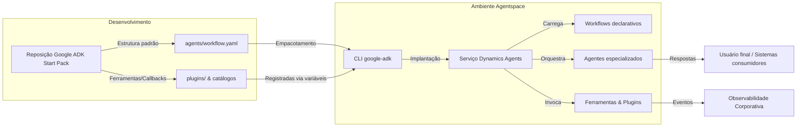

# Dynamics Agents Samples — Google ADK Start Pack

Este repositório exemplifica como organizar, configurar e operar soluções de agentes no **Google Agentspace** seguindo o layout oficial do **Google Agent Development Kit (ADK) Start Pack**. Ele serve como base para equipes de arquitetura, engenharia de sistemas e inteligência artificial que desejam padronizar repositórios de agentes dentro do ecossistema Google. A solução adota o **Dynamics Agents** como acelerador para geração em tempo real a partir de workflows, tendo o *Travel Planner* como exemplo principal.

## Objetivos do pacote

- **Padronizar a infraestrutura**: fornecer convenções de diretórios, arquivos de manifesto e dependências esperadas pelo Google ADK.
- **Demonstrar integrações práticas**: disponibilizar agentes de exemplo (como o *Travel Planner*) que utilizam o runtime **Dynamics Agents** para orquestração multimodal em tempo real.
- **Acelerar implantações no Agentspace**: orientar sobre variáveis de ambiente, automações e processos necessários para publicar workflows.

> ℹ️ Para conhecer em profundidade o runtime Dynamics Agents (arquitetura, versões, abertura de issues), consulte [`DynamicsAgents.md`](DynamicsAgents.md).

## Estrutura alinhada ao Google ADK Start Pack

```
.
├── agents/
│   ├── workflow.yaml          # Catálogo de workflows expostos ao ADK
│   └── travel_planner/        # Solução multiagente de planejamento de viagens
├── config/                    # Manifestos de ambiente e variáveis compartilhadas do Start Pack
├── docs/                      # Guias complementares e diagramas corporativos
├── plugins/                   # Extensões de runtime (observabilidade, auditoria, etc.)
├── scripts/                   # Automação operacional e utilitários ADK
├── tests/                     # Cenários determinísticos e fixtures do Travel Planner
├── requirements.txt           # Dependências Python compartilhadas
└── README.md                  # Visão geral da infraestrutura do pacote
```

As convenções acima permitem que o `google-adk` descubra workflows declarados em `agents/workflow.yaml`, localize seus manifestos (`app/workflow.yaml`) e gere artefatos consistentes segundo o Start Pack.

### Componentes principais do Start Pack

- `agents/workflow.yaml`: catálogo raiz que lista cada solução disponível para o Agentspace, vinculando o identificador público ao caminho do workflow.
- `agents/travel_planner/app/agent.py`: ponto de entrada compatível com o ADK que bootstrap a execução pelo Dynamics Agents Runtime.
- `agents/travel_planner/app/workflow.yaml`: workflow declarativo que descreve agentes, ferramentas, callbacks e passos operacionais do Travel Planner.
- `plugins/logging/events/runtime/any.00.runtime_logging.py`: plugin de exemplo pré-configurado para observabilidade estruturada do runtime.
- `requirements.txt`: dependências mínimas alinhadas ao Start Pack e ao runtime Dynamics Agents, incluindo a instalação da biblioteca privada como acelerador.

### Visão arquitetural



O diagrama acima resume o fluxo desde o desenvolvimento no padrão Start Pack até a execução operacional no Agentspace utilizando Dynamics Agents.

## Configuração mínima

1. **Ambiente Python**: utilize Python 3.10+ e crie um ambiente virtual dedicado.
   ```bash
   python -m venv .venv
   source .venv/bin/activate
   agents\travel_planner> pip install -r requirements.txt
   ```
   - O arquivo `requirements.txt` referencia a distribuição oficial privada `DynamicsAgents` hospedada em `github.com/wndt-gft/DynamicsAgents`.
   - Garanta que o ambiente possua acesso ao repositório (ex.: `pip install git+https://<token>@github.com/wndt-gft/DynamicsAgents.git@latest`).
2. **Variáveis de ambiente**: copie `.env.sample` (quando disponível) para `.env` e defina:
   - `GOOGLE_VERTEX_PROJECT` e `GOOGLE_VERTEX_LOCATION` para apontar o projeto/região do Vertex AI;
   - `GOOGLE_API_KEY` *ou* `GOOGLE_APPLICATION_CREDENTIALS` contendo credenciais de serviço;
   - `DA_WORKFLOW_SEARCH_PATHS` com o diretório `agents` (ou caminhos adicionais para workflows).
3. **Ferramentas Google ADK**: instale e configure o CLI `google-adk` conforme a documentação oficial do Start Pack. Este repositório não adiciona automatizações próprias de publicação; siga o fluxo padrão descrito pelo Google para empacotar e disponibilizar workflows.

## Execução via CLI do Google ADK

1. Posicione-se no diretório do agente: `cd agents/travel_planner`.
2. Execute um dos modos suportados pelo CLI `google-adk`, conforme a necessidade:

```bash
# Execução síncrona clássica
adk run app --input '{"query": "Planeje uma viagem para São Paulo"}'

# Servidor REST para prototipagem
adk api app --port 8080

# Interface web reativa
adk web --port 8080
```

Os comandos acima encapsulam o mesmo `agent.py` documentado em [`DynamicsAgents.md`](DynamicsAgents.md), garantindo que o runtime faça a descoberta dinâmica de workflows, instancie subagentes, ferramentas e callbacks, e emita eventos no barramento padrão antes de entregar respostas ao usuário.【F:DynamicsAgents.md†L336-L372】

## Ciclo de trabalho recomendado

1. **Descobrir workflows**: liste as entradas definidas em `agents/workflow.yaml` para escolher a solução desejada.
2. **Executar localmente**: importe o ponto de entrada padronizado `run` (`dynamic_agents.bootstrap_solution_entrypoints`) de cada agente.
   ```bash
   python -c "from agents.travel_planner.app.agent import run; run({\"session_id\": \"demo\"})"
   ```
3. **Validar extensões**: desenvolva plugins personalizados em `plugins/` e registre-os em `DA_RUNTIME_PLUGINS` para habilitar telemetria, auditoria ou integrações proprietárias.
4. **Publicar no Agentspace**: siga o guia oficial do Google ADK Start Pack para empacotar `agents/<solucao>/app/workflow.yaml`. Não há scripts personalizados neste repositório para implantação.

## Conteúdo disponível

- [`agents/travel_planner/readme.md`](agents/travel_planner/readme.md): documentação completa do agente *Travel Planner*, cobrindo subagentes, ferramentas, callbacks, plugins e metadados de workflow.
- [`DynamicsAgents.md`](DynamicsAgents.md): visão aprofundada da tecnologia Dynamics Agents, incluindo arquitetura, ciclo de vida, suporte e recursos oficiais.
- [`workflow.md`](workflow.md): guia de referência das tags e estruturas aceitas em `workflow.yaml`, com descrições, resultados esperados e exemplos práticos.

## Próximos passos para equipes

1. **Clone o repositório padrão** e personalize uma cópia por solução ou domínio.
2. **Adicione novos agentes** replicando a estrutura do Start Pack dentro de `agents/<novo_agente>/`.
3. **Atualize `agents/workflow.yaml`** para incluir seus workflows e garanta que os testes locais passem antes da publicação.
4. **Implemente automações CI/CD** que executem lint, testes determinísticos e verificação de segurança antes de acionar os comandos oficiais do ADK.

---

Para dúvidas relacionadas ao Dynamics Agents ou para reportar bugs no runtime oficial, utilize o link de issues descrito em [`DynamicsAgents.md`](DynamicsAgents.md).
