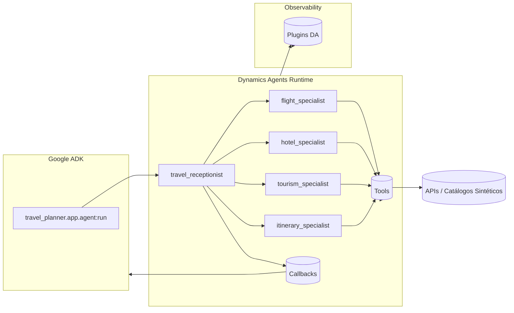
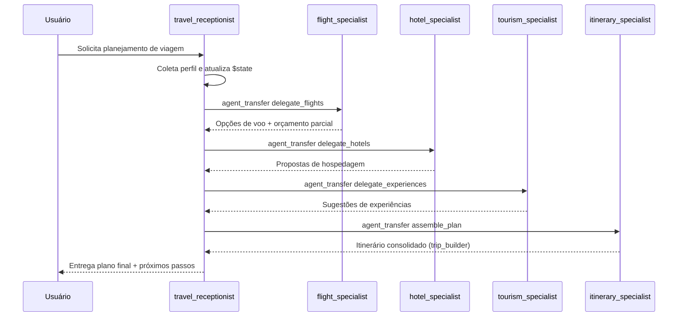
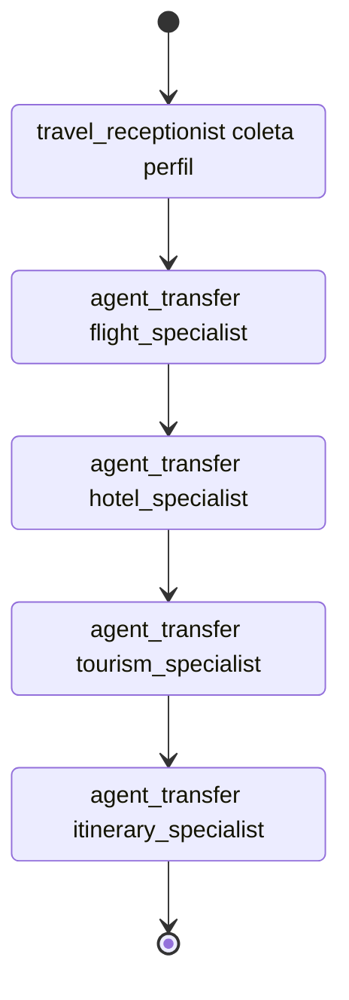
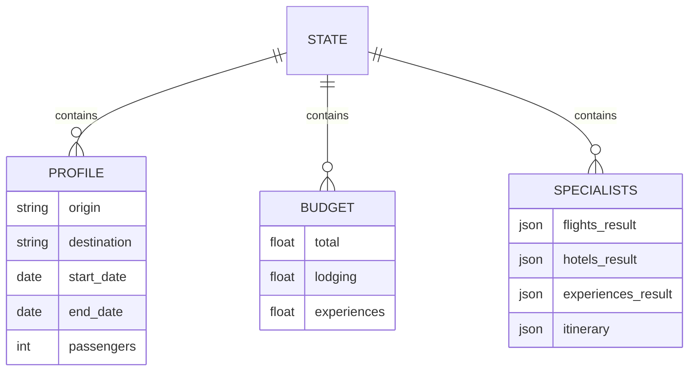

# Travel Planner Agent

O *Travel Planner* demonstra uma concierge multiagente construída com Dynamics Agents e empacotada no padrão Google ADK Start Pack. Este documento descreve em detalhes cada componente, instruções operacionais e como o workflow é interpretado pelo runtime.

## Estrutura do diretório

```
agents/travel_planner/
├── app/
│   ├── agent.py          # Pontos de entrada bootstrapados pelo Dynamics Agents
│   └── workflow.yaml     # Definição declarativa do fluxo de trabalho
└── requirements.txt      # Dependências específicas da solução
```

O módulo `agent.py` expõe `app`, `root_agent` e `run`, seguindo o contrato esperado pelo Google ADK (`dynamic_agents.bootstrap_solution_entrypoints`).【F:agents/travel_planner/app/agent.py†L1-L18】

## Workflow e metadados

| Campo                     | Descrição |
|---------------------------|-----------|
| `version: 1`              | Especifica o schema atual suportado pelo runtime.【F:agents/travel_planner/app/workflow.yaml†L1-L1】 |
| `metadata.name`           | Nome público exibido no catálogo ADK: *Travel Planner*.【F:agents/travel_planner/app/workflow.yaml†L3-L5】 |
| `metadata.description`    | Resumo do objetivo do fluxo (concierge multiagente).【F:agents/travel_planner/app/workflow.yaml†L4-L5】 |
| `metadata.entrypoint_agent` | Define `travel_receptionist` como agente inicial da sessão.【F:agents/travel_planner/app/workflow.yaml†L6-L6】 |
| `model_settings.model`    | Configura o modelo padrão Gemini `gemini-2.5-pro`.【F:agents/travel_planner/app/workflow.yaml†L168-L169】 |

O workflow é catalogado em `agents/workflow.yaml`, permitindo que o Google ADK localize `travel_planner/app/workflow.yaml` ao publicar para o Agentspace.【F:agents/workflow.yaml†L6-L10】

## Visão geral da jornada

1. **Coleta de perfil** do viajante (destino, datas, orçamento, preferências).
2. **Delegação sequencial** para especialistas em voos, hospedagem e experiências.
3. **Montagem colaborativa** do itinerário final com base nas respostas coletadas.
4. **Registro contínuo** de transcrições via callback `conversation_stream`.

### Arquitetura integrada



### Fluxo de alto nível



## Subagentes

### `travel_receptionist` (agente principal)
- Papel: conduz toda a experiência e coordena especialistas.【F:agents/travel_planner/app/workflow.yaml†L23-L70】
- Instruções de sistema: reforçam isolamento de sessão, coleta de dados obrigatórios e delegações responsáveis.【F:agents/travel_planner/app/workflow.yaml†L27-L44】
- Instruções do assistente: listam protocolos de registro no estado, gatilhos de delegação e regras de fechamento.【F:agents/travel_planner/app/workflow.yaml†L45-L69】
- Workflow interno: passos `collect_profile`, `delegate_flights`, `delegate_hotels`, `delegate_experiences` e `assemble_plan`.【F:agents/travel_planner/app/workflow.yaml†L71-L167】

### `flight_specialist`
- Rótulo: "Especialista em Voos".【F:agents/travel_planner/app/workflow.yaml†L171-L172】
- Responsabilidade: negociar rotas e tarifas dentro do orçamento informado em `delegate_flights`.
- Entrada esperada: origem, destino, datas, número de passageiros e orçamento total fornecidos via `$state` no momento da delegação.【F:agents/travel_planner/app/workflow.yaml†L88-L117】

### `hotel_specialist`
- Rótulo: "Especialista em Hospedagem".【F:agents/travel_planner/app/workflow.yaml†L173-L174】
- Responsabilidade: propor opções de hospedagem alinhadas às datas e ao orçamento de hospedagem.
- Entrada esperada: destino, datas de check-in/out, hóspedes, orçamento total e de hospedagem do estado compartilhado.【F:agents/travel_planner/app/workflow.yaml†L119-L145】

### `tourism_specialist`
- Rótulo: "Especialista em Turismo".【F:agents/travel_planner/app/workflow.yaml†L169-L170】
- Responsabilidade: sugerir experiências, passeios e gastronomia conforme preferências.
- Entrada esperada: destino, intervalo de viagem, interesses e orçamento para experiências providos pelo estado.【F:agents/travel_planner/app/workflow.yaml†L147-L160】

### `itinerary_specialist`
- Rótulo: "Especialista em Itinerário".【F:agents/travel_planner/app/workflow.yaml†L175-L176】
- Responsabilidade: consolidar voos, hospedagem e experiências em um plano final estruturado.
- Entrada esperada: destino, datas, resultados dos especialistas anteriores e orçamento agregado.【F:agents/travel_planner/app/workflow.yaml†L161-L167】



## Ferramentas

| Ferramenta           | Tipo         | Métodos | Uso |
|----------------------|--------------|---------|-----|
| `web_travel_search`  | Interativa   | `search_hotels`, `search_flights`, `search_experiences` | Simula um catálogo sintético para fornecer resultados determinísticos durante testes.【F:agents/travel_planner/app/workflow.yaml†L9-L16】 |
| `trip_builder`       | Interativa   | `compile_itinerary` | Consolida itens retornados pelos especialistas em um itinerário por agente.【F:agents/travel_planner/app/workflow.yaml†L17-L20】 |

As ferramentas devem estar registradas nos caminhos declarados em `DA_TOOL_CODE_PATHS`. Durante execuções guiadas pelo ADK, elas são carregadas automaticamente com base no catálogo do workflow.

## Callbacks

- `conversation_stream` (evento `after_model_response`): registra cada mensagem gerada pelos agentes, possibilitando auditoria e acompanhamento em tempo real.【F:agents/travel_planner/app/workflow.yaml†L21-L29】
- O mesmo callback é reiterado em cada etapa crítica para garantir que as respostas intermediárias também sejam persistidas.【F:agents/travel_planner/app/workflow.yaml†L78-L167】

## Plugins

A solução não habilita plugins por padrão, mas o diretório raiz `plugins/` permite adicionar instrumentações customizadas (ex.: logging estruturado). Basta implementar o plugin e exportar seu caminho em `DA_RUNTIME_PLUGINS` antes de iniciar o agente.

## Integração com o Dynamics Agents Runtime

- **Descoberta dinâmica**: o `DynamicAgentRuntime` varre catálogos declarativos (`runtime.yaml`, `workflow.yaml`) para montar a hierarquia de agentes e ferramentas em tempo de execução, eliminando código boilerplate de wiring.【F:DynamicsAgents.md†L144-L165】【F:DynamicsAgents.md†L220-L255】
- **Barramento de eventos**: cada ação relevante (entrada/saída de agentes, ferramentas ou callbacks) emite eventos enriquecidos consumidos por plugins registrados, permitindo auditoria em tempo real e telemetria corporativa.【F:DynamicsAgents.md†L188-L217】
- **Extensibilidade corporativa**: plugins localizados em `plugins/<namespace>/<category>` podem ser ativados via `DA_RUNTIME_PLUGINS` e configurados com `AGENT_ENGINE_LOG_LEVEL`, atendendo a requisitos de observabilidade ou compliance.【F:DynamicsAgents.md†L212-L274】
- **Ambiente padronizado**: utilize as variáveis `DA_WORKFLOW_SEARCH_PATHS`, `DA_AGENT_CODE_PATHS` e `DA_TOOL_CODE_PATHS` para compartilhar implementações reutilizáveis entre agentes, preservando a arquitetura Start Pack e simplificando a adoção em múltiplos workspaces.【F:DynamicsAgents.md†L264-L276】

## Estado compartilhado

O workflow utiliza um namespace consistente (`$state`) para persistir:
- Dados principais do viajante (`origin`, `destination`, `travel_dates.*`, `travel.passengers`).【F:agents/travel_planner/app/workflow.yaml†L73-L103】
- Orçamento detalhado (`budget.total`, `budget.lodging`, `budget.experiences`).【F:agents/travel_planner/app/workflow.yaml†L73-L157】
- Resultados e histórico dos especialistas (`specialists.*.result`, `specialists.*.invocations`).【F:agents/travel_planner/app/workflow.yaml†L49-L69】【F:agents/travel_planner/app/workflow.yaml†L161-L167】

Esses dados são repassados automaticamente nas delegações (`agent_transfer`) para manter os especialistas sincronizados.

### Mapeamento de estado



## Execução

### Local
```bash
python -c "from agents.travel_planner.app.agent import run; run({\"session_id\": \"demo\"})"
```
- Antes de executar, instale o runtime privado com `pip install git+https://github.com/wndt-gft/DynamicsAgents.git@latest` ou utilize `agents/travel_planner/requirements.txt` (necessário acesso ao repositório).
- Certifique-se de configurar as variáveis `GOOGLE_VERTEX_PROJECT`, `GOOGLE_VERTEX_LOCATION`, credenciais (`GOOGLE_API_KEY` ou `GOOGLE_APPLICATION_CREDENTIALS`) e `DA_WORKFLOW_SEARCH_PATHS=agents`.

### CLI do Google ADK

1. Posicione-se na raiz do agente:
   ```bash
   cd agents/travel_planner
   ```
2. Escolha o modo desejado do CLI `google-adk`:

```bash
# Execução síncrona
adk run \
  --project-root . \
  --agent-path app.agent:run \
  --input '{"query": "Planeje uma viagem para São Paulo"}'

# Servidor REST
adk api \
  --project-root . \
  --agent-path app.agent:run \
  --host 0.0.0.0 --port 8080

# Interface web
adk web \
  --project-root . \
  --agent-path app.agent:run \
  --port 8080
```

Todos os modos utilizam o mesmo `agent.py` descrito em [`DynamicsAgents.md`](../../DynamicsAgents.md), garantindo que o runtime monte subagentes, ferramentas e callbacks antes de responder pelo barramento oficial do Google ADK.【F:DynamicsAgents.md†L336-L372】

### Implantação via Google ADK
- Siga as instruções oficiais do Google ADK Start Pack para empacotar e publicar `agents/travel_planner/app/workflow.yaml` no Agentspace.
- Este repositório não contém automações adicionais de `deploy`; utilize os comandos padrão do CLI `google-adk` conforme a documentação.

## Extensões recomendadas

1. **Adicionar plugins corporativos**: implemente middlewares de auditoria/monitoramento em `plugins/` e registre-os via variável de ambiente.
2. **Expandir ferramentas**: adicione novos métodos ao catálogo (por exemplo, `loyalty_programs.check_status`) e implemente o código correspondente.
3. **Customizar modelos**: altere `model_settings.model` para variantes Gemini específicas por agente, caso necessário.
4. **Automatizar testes**: componha cenários determinísticos que cubram ferramentas, callbacks e delegações antes de habilitá-los no Travel Planner.
